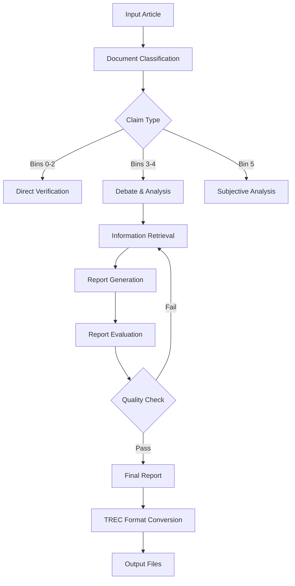

# TREC-2025-DRAGUN: AI-Powered Document Analysis and Report Generation

A sophisticated AI pipeline for analyzing news articles and generating comprehensive reports with fact-checking capabilities. This project implements an iterative report generation system that combines information retrieval, AI-powered analysis, and evaluation to produce high-quality, well-sourced reports.

## 🎯 Project Overview

This system takes news articles as input and generates detailed reports through an iterative process:

1. **Document Analysis**: Classifies and analyzes the input document
2. **Information Retrieval**: Searches for supporting evidence and context
3. **Report Generation**: Creates comprehensive reports using AI
4. **Evaluation & Refinement**: Evaluates report quality and iteratively improves it
5. **TREC Integration**: Generates TREC-2025-DRAGUN compliant outputs

## 🏗️ Architecture



## 📁 Project Structure

```
TrecDylanDan/
├── main.py                          # Main pipeline entry point
├── topics.py                        # Sample topic definitions
├── trec-2025-dragun-topics.jsonl    # TREC topics file
├── src/
│   ├── IR_Ensemble/                 # Information Retrieval System
│   │   ├── context_builder.py       # Context generation orchestrator
│   │   └── QA_Assistant/            # Search and retrieval components
│   │       ├── Searcher.py          # Search interface with Cohere reranking
│   │       ├── bucket_monitor.py    # Rate limiting
│   │       ├── daemon_wrapper.py    # JVM daemon management
│   │       ├── Search/              # Java-based BM25 search implementation
│   │       └── ...
│   ├── ReportGenerator/             # Report generation system
│   │   ├── report_generator.py      # Main report generator
│   │   └── prompts.py               # Generation prompts
│   ├── ReportEvaluator/             # Report evaluation system
│   │   ├── report_evaluator.py      # Report evaluator
│   │   └── prompts.py               # Evaluation prompts
│   ├── RunGeneration/               # TREC output generation
│   │   ├── generate_runs.py         # Generate TREC runs
│   │   ├── test_run_format.py       # Format validation
│   │   ├── convert_to_run_format.py # Format conversion
│   │   └── README.md                # TREC documentation
│   ├── DebateAndReport/             # Debate system (archived)
│   └── QuestionGeneration/          # Question generation (archived)
├── Archive/                         # Historical implementations
├── DerivedData/                     # Generated data and outputs
├── MarcoIndex/                      # Search index storage
└── .env                             # Environment configuration
```

## 🚀 Quick Start

### Prerequisites

1. **Python Environment**: Python 3.8+ with virtual environment
2. **Java Runtime**: Java 8+ for BM25 search functionality
3. **Dependencies**: Install required packages from virtual environment
4. **Environment Variables**: Configure `.env` file

### Installation

```bash
# Clone the repository
git clone <repository-url>
cd TrecDylanDan

# Create virtual environment
python -m venv .venv
source .venv/bin/activate  # On Windows: .venv\Scripts\activate

# Install dependencies (packages are already installed in virtual environment)
# The project uses a pre-configured virtual environment

# Configure environment
# Create .env file with your API keys and settings
```

### Environment Configuration

Create a `.env` file with the following variables:

```bash
# OpenAI Configuration
OPENAI_API_KEY=your_openai_api_key
AZURE_OPENAI_KEY=your_azure_openai_key
AZURE_OPENAI_ENDPOINT=your_azure_endpoint

# File Paths
CONTEXT_PATH=DerivedData/ContextBuilder/context.txt
REPORT_PATH=DerivedData/Report/report.txt
EVAL_PATH=DerivedData/Evaluation/eval.txt

# Search Configuration
COHERE_API_KEY=your_cohere_api_key
BM25_RESULTS_PATH=DerivedData/SearchResults
```

### Basic Usage

```bash
# Run the main pipeline with sample topic
python main.py

# Generate TREC runs from topics file
python src/RunGeneration/generate_runs.py trec-2025-dragun-topics.jsonl runs.jsonl --max-topics 5

# Validate TREC output format
python src/RunGeneration/test_run_format.py runs.jsonl
```

## 🔧 Core Components

### 1. Information Retrieval (IR_Ensemble)

The IR system provides context and evidence for report generation:

- **ContextProctor**: Orchestrates concurrent search operations (max 4 workers)
- **Searcher**: Interfaces with Java BM25 search and Cohere reranking
- **Bucket Monitor**: Manages rate limiting and API quotas
- **JVMDaemon**: Manages Java-based search daemon for BM25 operations
- **Question Evaluation**: Assesses search result quality

```python
from src.IR_Ensemble.context_builder import ContextProctor

# Create context from questions
proc = ContextProctor(client, questions)
await proc.create_context()
```

### 2. Report Generator

Generates comprehensive reports using AI:

- **ReportGenerator**: Main report generation class
- **Iterative Improvement**: Up to 3 rounds of refinement (MAX_ROUNDS = 3)
- **Context Integration**: Incorporates search results
- **Note Tracking**: Maintains generation history
- **Structured Output**: Generates JSON with responses and citations

```python
from src.ReportGenerator.report_generator import ReportGenerator

# Generate report
generator = ReportGenerator(client=client, topic=topic)
report, notes = await generator.generate_report(context, previous_notes)
```

### 3. Report Evaluator

Evaluates report quality and generates improvement suggestions:

- **ReportEvaluator**: Main evaluation class
- **Quality Assessment**: Evaluates 6 criteria (coverage, accuracy, citation_quality, style, prioritization, completeness)
- **Scoring System**: Each criterion scored 1-5, weighted for total score
- **Question Generation**: Creates IR questions for gaps
- **Status Tracking**: PASS/FAIL based on 90% threshold of maximum score

```python
from src.ReportEvaluator.report_evaluator import ReportEvaluator, EvalStatus

# Evaluate report
evaluator = ReportEvaluator(client=client, topic=topic)
notes, questions = await evaluator.evaluate(report, context, generator_notes)
```

### 4. TREC Run Generation

Generates TREC-2025-DRAGUN compliant outputs:

- **Format Compliance**: Ensures proper JSONL structure
- **Validation**: Checks word limits and citation formats
- **Batch Processing**: Handles multiple topics efficiently
- **Team Integration**: Configurable team IDs and run IDs

```bash
# Generate runs for TREC submission
python src/RunGeneration/generate_runs.py topics.jsonl runs.jsonl \
    --team-id SCIAI \
    --run-id SCIAI-final-run \
    --type automatic
```

## 📊 Document Classification System

The system classifies documents into 6 bins based on claim type:

| Bin | Name | Description | Example |
|-----|------|-------------|---------|
| 0 | Verifiable Fact | Objective, checkable statements | "Water boils at 100°C" |
| 1 | Statistical Claim | Data-driven assertions | "Unemployment fell to 5.2%" |
| 2 | Causal Claim | Cause-effect relationships | "Exercise reduces heart disease risk" |
| 3 | Interpretive Claim | Analysis and conclusions | "Broadband drives remote work" |
| 4 | Value Judgment | Normative statements | "Governments should ban plastics" |
| 5 | Subjective Preference | Personal opinions | "Blue is the best color" |

## 🔄 Pipeline Flow

### Main Pipeline (`main.py`)

1. **Initialization**: Set up OpenAI and Azure OpenAI clients
2. **Topic Processing**: Load and process input topic
3. **Iterative Loop**: 
   - Generate report (up to 3 rounds)
   - Evaluate quality
   - Retrieve additional context if needed
   - Repeat until quality threshold met or max rounds reached
4. **Output**: Final report and TREC-compliant files

### Information Retrieval Process

1. **Question Generation**: Create search queries from evaluation
2. **BM25 Search**: Java-based search using Lucene
3. **Cohere Reranking**: Rerank top 75 results using Cohere v3.5
4. **Result Aggregation**: Select top 15 results
5. **Context Building**: Create comprehensive context for report generation

### Report Generation Process

1. **Context Integration**: Incorporate search results
2. **Report Creation**: Generate structured JSON with responses and citations
3. **Note Tracking**: Maintain generation history
4. **Iterative Refinement**: Improve based on feedback (max 3 rounds)

## 📈 TREC-2025-DRAGUN Integration

The system generates TREC-compliant outputs with:

- **Proper Format**: JSONL with metadata and responses
- **Word Limits**: ≤250 words total across responses
- **Citations**: Up to 4 citations per response (as per actual implementation)
- **Team Information**: Configurable team and run IDs

### Output Format

```json
{
  "metadata": {
    "team_id": "SCIAI",
    "run_id": "SCIAI-run-example",
    "topic_id": "msmarco_v2.1_doc_xx_xxxxx0",
    "type": "automatic",
    "use_starter_kit": 0
  },
  "responses": [
    {
      "text": "Generated sentence with facts.",
      "citations": ["doc_id#segment_id"]
    }
  ]
}
```

## 🛠️ Development

### Adding New Components

1. **Create Module**: Add new directory in `src/`
2. **Implement Class**: Follow existing patterns
3. **Add Integration**: Update main pipeline
4. **Test**: Validate with sample data

### Configuration

- **Rate Limits**: Adjust in `bucket_monitor.py`
- **Model Selection**: Configure in component files
- **File Paths**: Set in `.env` file
- **Search APIs**: Configure in `Searcher.py`
- **Java Classpath**: Configure in `daemon_wrapper.py`

### Testing

```bash
# Test individual components
python -m pytest tests/

# Test TREC format
python src/RunGeneration/test_run_format.py sample

# Test full pipeline
python main.py
```